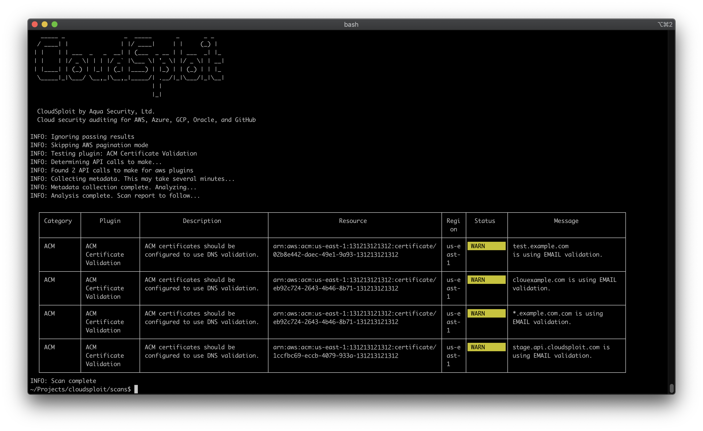

[](https://cloud.aquasec.com/signup)

[](https://travis-ci.org/cloudsploit/scans)

CloudSploit Scans
=================

[](https://cloud.aquasec.com/signup)

## Quick Start
```
$ git clone git@github.com:cloudsploit/scans.git
$ cd scans
$ npm install
$ ./index.js -h
```

## Documentation
* [Background](#background)
* [Deployment Options](#deployment-options)
  + [Self-Hosted](#self-hosted)
  + [Hosted at Aqua Wave (SaaS)](#hosted-at-aqua-wave--saas-)
* [Installation](#installation)
* [Configuration](#configuration)
  + [Amazon Web Services](docs/aws.md#cloud-provider-configuration)
  + [Microsoft Azure](docs/azure.md#cloud-provider-configuration)
  + [Google Cloud Platform](docs/gcp.md#cloud-provider-configuration)
  + [Oracle Cloud Infrastructure](docs/oracle.md#cloud-provider-configuration)
* [Running](#running)
* [CLI Options](#cli-options)
* [Compliance](#compliance)
  + [HIPAA](#hipaa)
  + [PCI](#pci)
  + [CIS Benchmarks](#cis-benchmarks)
* [Output Formats](#output-formats)
  + [Console Output](#console-output)
  + [Ignoring Passing Results](#ignoring-passing-results)
  + [CSV](#csv)
  + [JSON](#json)
  + [JUnit XML](#junit-xml)
  + [Collection Output](#collection-output)
* [Suppressions](#suppressions)
* [Running a Single Plugin](#running-a-single-plugin)
* [Architecture](#architecture)
* [Writing a Plugin](#writing-a-plugin)
* [Other Notes](#other-notes)

## Background
CloudSploit by Aqua is an open-source project designed to allow detection of security risks in cloud infrastructure accounts, including: Amazon Web Services (AWS), Microsoft Azure, Google Cloud Platform (GCP), Oracle Cloud Infrastructure (OCI), and GitHub. These scripts are designed to return a series of potential misconfigurations and security risks.

## Deployment Options
CloudSploit is available in two deployment options:

### Self-Hosted
Follow the instructions below to deploy the open-source version of CloudSploit on your machine in just a few simple steps.

### Hosted at Aqua Wave (SaaS)
CloudSploit is provided as part of Aqua Wave, a fully-managed cloud security solution maintained and updated by the cloud security experts at Aqua. Our hosted scanner handles the scheduling and running of background scans, aggregation of data into dashboards, tools, and visualizations, and integrates with popular third-party services for alerts.

Sign up for [Aqua Wave](https://cloud.aquasec.com/signup) today!

## Installation
Ensure that NodeJS is installed. If not, install it from [here](https://nodejs.org/download/).

```
$ git clone git@github.com:cloudsploit/scans.git
$ npm install
```

## Configuration
CloudSploit requires read-only permission to your cloud account. Follow the guides below to provision this access:

* [Amazon Web Services](docs/aws.md#cloud-provider-configuration)
* [Microsoft Azure](docs/azure.md#cloud-provider-configuration)
* [Google Cloud Platform](docs/gcp.md#cloud-provider-configuration)
* [Oracle Cloud Infrastructure](docs/oracle.md#cloud-provider-configuration)

To begin using the scanner, edit the `index.js` file with the corresponding settings. You can use any of these three options:
 * Enter your settings [inline](https://github.com/cloudsploit/scans/blob/master/index.js#L13-L53).
 * Create a json [file](https://github.com/cloudsploit/scans/blob/master/index.js#L57-L61).
 * Use [environment variables](https://github.com/cloudsploit/scans/blob/master/index.js#L64-L109). 

## Running
To run a standard scan, showing all outputs and results, simply run:
```
$ ./index.js
```

## CLI Options
CloudSploit supports many options to customize the run time. Some popular options include:
* AWS GovCloud support: `--govcloud`
* AWS China support: `--china`
* Save the raw cloud provider response data: `--collection=file.json`
* Ignore passing (OK) results: `--ignore-ok`
* Exit with a non-zero code if non-passing results are found: `--exit-code`
  * This is a good option for CI/CD systems
* Change the output from a table to raw text: `--console=text`

See [Output Formats](#output-formates) below for more output options.

<details>
  <summary>Click for a full list of options</summary>

  ```
  $ ./index.js -h

    _____ _                 _  _____       _       _ _
    / ____| |               | |/ ____|     | |     (_) |
  | |    | | ___  _   _  __| | (___  _ __ | | ___  _| |_
  | |    | |/ _ \| | | |/ _` |\___ \| '_ \| |/ _ \| | __|
  | |____| | (_) | |_| | (_| |____) | |_) | | (_) | | |_
    \_____|_|\___/ \__,_|\__,_|_____/| .__/|_|\___/|_|\__|
                                    | |
                                    |_|

    CloudSploit by Aqua Security, Ltd.
    Cloud security auditing for AWS, Azure, GCP, Oracle, and GitHub

  usage: index.js [-h] --credentials CREDENTIALS [--compliance {hipaa,cis,cis1,cis2,pci}] [--plugin PLUGIN] [--govcloud] [--china] [--csv CSV] [--json JSON] [--junit JUNIT]
                  [--table] [--console {none,text,table}] [--collection COLLECTION] [--ignore-ok] [--exit-code] [--skip-paginate] [--suppress SUPPRESS]
                  [--skip-region SKIP_REGION]

  optional arguments:
    -h, --help            show this help message and exit
    --credentials CREDENTIALS
                          The path to a cloud provider credentials file.
    --compliance {hipaa,cis,cis1,cis2,pci}
                          Compliance mode. Only return results applicable to the selected program.
    --plugin PLUGIN       A specific plugin to run. If none provided, all plugins will be run. Obtain from the exports.js file. E.g. acmValidation
    --govcloud            AWS only. Enables GovCloud mode.
    --china               AWS only. Enables AWS China mode.
    --csv CSV             Output: CSV file
    --json JSON           Output: JSON file
    --junit JUNIT         Output: Junit file
    --table               Output: table
    --console {none,text,table}
                          Console output format. Default: table
    --collection COLLECTION
                          Output: full collection JSON as file
    --ignore-ok           Ignore passing (OK) results
    --exit-code           Exits with a non-zero status code if non-passing results are found
    --skip-paginate       AWS only. Skips pagination (for debugging).
    --suppress SUPPRESS   Suppress results matching the provided Regex. Format: pluginId:region:resourceId
    --skip-region SKIP_REGION
                          Skips provided region or location (e.g. --skip-region=us-east-1
  ```
</details>

## Compliance

CloudSploit supports mapping of its plugins to particular compliance policies. To run the compliance scan, use the `--compliance` flag. For example:
```
$ ./index.js --compliance=hipaa
$ ./index.js --compliance=pci
```

CloudSploit currently supports the following compliance mappings:

### HIPAA
```
$ ./index.js --compliance=hipaa
```
HIPAA scans map CloudSploit plugins to the Health Insurance Portability and Accountability Act of 1996.

### PCI
```
$ ./index.js --compliance=pci
```
PCI scans map CloudSploit plugins to the Payment Card Industry Data Security Standard.

### CIS Benchmarks
```
$ ./index.js --compliance=cis
$ ./index.js --compliance=cis1
$ ./index.js --compliance=cis2
```

CIS Benchmarks are supported, both for Level 1 and Level 2 controls.

## Output Formats
CloudSploit supports output in several formats for consumption by other tools. If you do not specify otherwise, CloudSploit writes output to standard output (the console) as a table.

Note: You can pass multiple output formats and combine options for further customization. For example:
```
# Print a table to the console and save a CSV file
$ ./index.js --csv=file.csv --console=table

# Print text to the console and save a JSON and JUnit file while ignoring passing results
$ ./index.js --json=file.json --junit=file.xml --console=text --ignore-ok
```

### Console Output
By default, CloudSploit results are printed to the console in a table format (with colors). You can override this and use plain text instead, by running:
```
$ ./index.js --console=text
```

Alternatively, you can suppress the console output entirely by running:
```
$ ./index.js --console=none
```

### Ignoring Passing Results
You can ignore results from output that return an OK status by passing a `--ignore-ok` commandline argument.

### CSV
```
$ ./index.js --csv=file.csv
```

### JSON
```
$ ./index.js --json=file.json
```

### JUnit XML
```
$ ./index.js --junit=file.xml
```

### Collection Output
CloudSploit saves the data queried from the cloud provider APIs in JSON format, which can be saved alongside other files for debugging or historical purposes.
```
$ ./index.js --collection=file.json
```

## Suppressions
Results can be suppressed by passing the `--suppress` flag (multiple options are supported) with the following format:
```
--suppress pluginId:region:resourceId
```

For example:
```
# Suppress all results for the acmValidation plugin
$ ./index.js --suppress acmValidation:*:*

# Suppress all us-east-1 region results
$ ./index.js --suppress *:us-east-1:*

# Suppress all results matching the regex "certificate/*" in all regions for all plugins
$ ./index.js --suppress *:*:certificate/*
```

## Running a Single Plugin
The `--plugin` flag can be used if you only wish to run one plugin.
```
$ ./index.js --plugin acmValidation
```

## Architecture
CloudSploit works in two phases. First, it queries the cloud infrastructure APIs for various metadata about your account, namely the "collection" phase. Once all the necessary data is collected, the result is passed to the "scanning" phase. The scan uses the collected data to search for potential misconfigurations, risks, and other security issues, which are the resulting output.

## Writing a Plugin
Please see our [contribution guidelines](.github/CONTRIBUTING.md) and [complete guide](docs/writing-plugins.md) to writing CloudSploit plugins.

## Other Notes
For other details about the Aqua Wave SaaS product, AWS security policies, and more, [click here](docs/notes.md).
