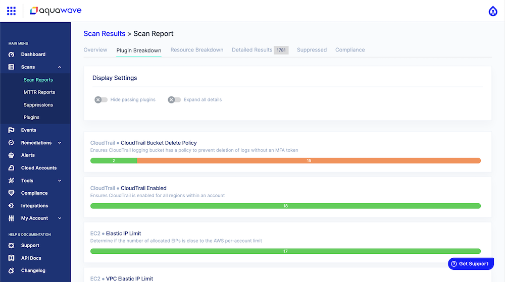

# Notes

## Hosted SaaS
When using the [hosted scanner](https://cloud.aquasec.com/signup), you will be able to see an intuitive visual representation of the scan results. In the Aqua Wave console, printable scan results look as follows:

[](https://cloud.aquasec.com/signup)

## Cross-Account IAM Role
Cross-account roles enable you to share access to your account with another AWS account using the same policy model that you're used to within AWS services' scope.
 
The advantage is that cross-account roles are much more secure than key-based access, since an attacker who steals a cross-account role ARN still cannot make API calls unless he/she also infiltrates the AWS account that has been authorized to use the role in question.

To create a cross-account role:

```
1. Navigate to the [IAM console](https://console.aws.amazon.com/iam/home).
2. Log into your AWS account and navigate to the IAM console.
3. Create a new IAM role.
4. When prompted for a trusted entity select: "Another AWS account".
5. Enter "057012691312" for the account to trust (Account ID).
6. Check the box to "Require external ID" and enter the external ID displayed below.
7. Ensure that MFA token is not selected.
8. Select the "SecurityAudit" managed policy.
9. Enter a memorable role name and create the role.
10. Then click on the role name and copy the role ARN for use in the next step.
```

## CloudSploit Supplemental Policy
Allows read only access to services not included in the SecurityAudit AWS Managed policy but that are also tested by the CSPM scans.

```$xslt
{
    "Version": "2012-10-17",
    "Statement": [
        {
            "Action": [
                "ses:DescribeActiveReceiptRuleSet",
                "athena:GetWorkGroup",
                "logs:DescribeLogGroups",
                "logs:DescribeMetricFilters",
                "elastictranscoder:ListPipelines",
                "elasticfilesystem:DescribeFileSystems",
                "servicequotas:ListServiceQuotas"
            ],
            "Resource": "*",
            "Effect": "Allow"
        }
    ]
}
```

## AWS Inline Policy (Not Recommended)
If you'd prefer to be more restrictive, the following IAM policy contains the exact permissions used by the scan.

**WARNING:** This policy will likely change as more plugins are written. If a test returns "UNKNOWN" it is likely missing a required permission. The preferred method is to use the "SecurityAudit" policy.

```
{
    "Version": "2012-10-17",
    "Statement": [
        {
            "Effect": "Allow",
            "Resource": "*",
            "Action": [
                "acm:Describe*",
                "acm:List*",
                "application-autoscaling:Describe*",
                "appmesh:Describe*",
                "appmesh:List*",
                "appsync:List*",
                "athena:List*",
                "athena:GetWorkGroup",
                "autoscaling:Describe*",
                "batch:DescribeComputeEnvironments",
                "batch:DescribeJobDefinitions",
                "chime:List*",
                "cloud9:Describe*",
                "cloud9:ListEnvironments",
                "clouddirectory:ListDirectories",
                "cloudformation:DescribeStack*",
                "cloudformation:GetTemplate",
                "cloudformation:ListStack*",
                "cloudformation:GetStackPolicy",
                "cloudfront:Get*",
                "cloudfront:List*",
                "cloudhsm:ListHapgs",
                "cloudhsm:ListHsms",
                "cloudhsm:ListLunaClients",
                "cloudsearch:DescribeDomains",
                "cloudsearch:DescribeServiceAccessPolicies",
                "cloudtrail:DescribeTrails",
                "cloudtrail:GetEventSelectors",
                "cloudtrail:GetTrailStatus",
                "cloudtrail:ListTags",
                "cloudtrail:LookupEvents",
                "cloudwatch:Describe*",
                "codebuild:ListProjects",
                "codecommit:BatchGetRepositories",
                "codecommit:GetBranch",
                "codecommit:GetObjectIdentifier",
                "codecommit:GetRepository",
                "codecommit:List*",
                "codedeploy:Batch*",
                "codedeploy:Get*",
                "codedeploy:List*",
                "codepipeline:ListPipelines",
                "codestar:Describe*",
                "codestar:List*",
                "cognito-identity:ListIdentityPools",
                "cognito-idp:ListUserPools",
                "cognito-sync:Describe*",
                "cognito-sync:List*",
                "comprehend:Describe*",
                "comprehend:List*",
                "config:BatchGetAggregateResourceConfig",
                "config:BatchGetResourceConfig",
                "config:Deliver*",
                "config:Describe*",
                "config:Get*",
                "config:List*",
                "datapipeline:DescribeObjects",
                "datapipeline:DescribePipelines",
                "datapipeline:EvaluateExpression",
                "datapipeline:GetPipelineDefinition",
                "datapipeline:ListPipelines",
                "datapipeline:QueryObjects",
                "datapipeline:ValidatePipelineDefinition",
                "datasync:Describe*",
                "datasync:List*",
                "dax:Describe*",
                "dax:ListTags",
                "directconnect:Describe*",
                "dms:Describe*",
                "dms:ListTagsForResource",
                "ds:DescribeDirectories",
                "dynamodb:DescribeContinuousBackups",
                "dynamodb:DescribeGlobalTable",
                "dynamodb:DescribeTable",
                "dynamodb:DescribeTimeToLive",
                "dynamodb:ListBackups",
                "dynamodb:ListGlobalTables",
                "dynamodb:ListStreams",
                "dynamodb:ListTables",
                "ec2:Describe*",
                "ecr:DescribeRepositories",
                "ecr:GetRepositoryPolicy",
                "ecs:Describe*",
                "ecs:List*",
                "eks:DescribeCluster",
                "eks:ListClusters",
                "elasticache:Describe*",
                "elasticbeanstalk:Describe*",
                "elasticfilesystem:DescribeFileSystems",
                "elasticfilesystem:DescribeMountTargetSecurityGroups",
                "elasticfilesystem:DescribeMountTargets",
                "elasticloadbalancing:Describe*",
                "elasticmapreduce:Describe*",
                "elasticmapreduce:ListClusters",
                "elasticmapreduce:ListInstances",
                "elastictranscoder:ListPipelines",
                "es:Describe*",
                "es:ListDomainNames",
                "events:Describe*",
                "events:List*",
                "firehose:Describe*",
                "firehose:List*",
                "fms:ListComplianceStatus",
                "fms:ListPolicies",
                "fsx:Describe*",
                "fsx:List*",
                "gamelift:ListBuilds",
                "gamelift:ListFleets",
                "glacier:DescribeVault",
                "glacier:GetVaultAccessPolicy",
                "glacier:ListVaults",
                "globalaccelerator:Describe*",
                "globalaccelerator:List*",
                "greengrass:List*",
                "guardduty:Get*",
                "guardduty:List*",
                "iam:GenerateCredentialReport",
                "iam:GenerateServiceLastAccessedDetails",
                "iam:Get*",
                "iam:List*",
                "iam:SimulateCustomPolicy",
                "iam:SimulatePrincipalPolicy",
                "inspector:Describe*",
                "inspector:Get*",
                "inspector:List*",
                "inspector:Preview*",
                "iot:Describe*",
                "iot:GetPolicy",
                "iot:GetPolicyVersion",
                "iot:List*",
                "kinesis:DescribeStream",
                "kinesis:ListStreams",
                "kinesis:ListTagsForStream",
                "kinesisanalytics:ListApplications",
                "kms:Describe*",
                "kms:Get*",
                "kms:List*",
                "lambda:GetAccountSettings",
                "lambda:GetFunctionConfiguration",
                "lambda:GetLayerVersionPolicy",
                "lambda:GetPolicy",
                "lambda:List*",
                "license-manager:List*",
                "lightsail:GetInstances",
                "lightsail:GetLoadBalancers",
                "logs:Describe*",
                "logs:ListTagsLogGroup",
                "machinelearning:DescribeMLModels",
                "mediaconnect:Describe*",
                "mediaconnect:List*",
                "mediastore:GetContainerPolicy",
                "mediastore:ListContainers",
                "opsworks:DescribeStacks",
                "opsworks-cm:DescribeServers",
                "organizations:List*",
                "organizations:Describe*",
                "quicksight:Describe*",
                "quicksight:List*",
                "ram:List*",
                "rds:Describe*",
                "rds:DownloadDBLogFilePortion",
                "rds:ListTagsForResource",
                "redshift:Describe*",
                "rekognition:Describe*",
                "rekognition:List*",
                "robomaker:Describe*",
                "robomaker:List*",
                "route53:Get*",
                "route53:List*",
                "route53domains:GetDomainDetail",
                "route53domains:GetOperationDetail",
                "route53domains:ListDomains",
                "route53domains:ListOperations",
                "route53domains:ListTagsForDomain",
                "route53resolver:List*",
                "route53resolver:Get*",
                "s3:GetAccelerateConfiguration",
                "s3:GetAccountPublicAccessBlock",
                "s3:GetAnalyticsConfiguration",
                "s3:GetBucket*",
                "s3:GetEncryptionConfiguration",
                "s3:GetInventoryConfiguration",
                "s3:GetLifecycleConfiguration",
                "s3:GetMetricsConfiguration",
                "s3:GetObjectAcl",
                "s3:GetObjectVersionAcl",
                "s3:GetReplicationConfiguration",
                "s3:ListAllMyBuckets",
                "sagemaker:Describe*",
                "sagemaker:List*",
                "sdb:DomainMetadata",
                "sdb:ListDomains",
                "secretsmanager:GetResourcePolicy",
                "secretsmanager:ListSecrets",
                "secretsmanager:ListSecretVersionIds",
                "securityhub:Describe*",
                "securityhub:Get*",
                "securityhub:List*",
                "serverlessrepo:GetApplicationPolicy",
                "serverlessrepo:List*",
                "servicequotas:ListServiceQuotas",
                "ses:GetIdentityDkimAttributes",
                "ses:GetIdentityPolicies",
                "ses:GetIdentityVerificationAttributes",
                "ses:ListIdentities",
                "ses:ListIdentityPolicies",
                "ses:ListVerifiedEmailAddresses",
                "ses:DescribeActiveReceiptRuleSet",
                "shield:Describe*",
                "shield:List*",
                "snowball:ListClusters",
                "snowball:ListJobs",
                "sns:GetTopicAttributes",
                "sns:ListSubscriptionsByTopic",
                "sns:ListTopics",
                "sqs:GetQueueAttributes",
                "sqs:ListDeadLetterSourceQueues",
                "sqs:ListQueues",
                "sqs:ListQueueTags",
                "ssm:Describe*",
                "ssm:GetAutomationExecution",
                "ssm:ListDocuments",
                "sso:DescribePermissionsPolicies",
                "sso:List*",
                "states:ListStateMachines",
                "storagegateway:DescribeBandwidthRateLimit",
                "storagegateway:DescribeCache",
                "storagegateway:DescribeCachediSCSIVolumes",
                "storagegateway:DescribeGatewayInformation",
                "storagegateway:DescribeMaintenanceStartTime",
                "storagegateway:DescribeNFSFileShares",
                "storagegateway:DescribeSnapshotSchedule",
                "storagegateway:DescribeStorediSCSIVolumes",
                "storagegateway:DescribeTapeArchives",
                "storagegateway:DescribeTapeRecoveryPoints",
                "storagegateway:DescribeTapes",
                "storagegateway:DescribeUploadBuffer",
                "storagegateway:DescribeVTLDevices",
                "storagegateway:DescribeWorkingStorage",
                "storagegateway:List*",
                "tag:GetResources",
                "tag:GetTagKeys",
                "transfer:Describe*",
                "transfer:List*",
                "translate:List*",
                "trustedadvisor:Describe*",
                "waf:ListWebACLs",
                "waf-regional:ListWebACLs",
                "workspaces:Describe*",
                "xray:Get*"
            ]
        },
        {
            "Effect": "Allow",
            "Action": [
                "apigateway:GET"
            ],
            "Resource": [
                "arn:aws:apigateway:*::/apis",
                "arn:aws:apigateway:*::/apis/*/stages",
                "arn:aws:apigateway:*::/apis/*/stages/*",
                "arn:aws:apigateway:*::/apis/*/routes",
                "arn:aws:apigateway:*::/restapis",
                "arn:aws:apigateway:*::/restapis/*/authorizers",
                "arn:aws:apigateway:*::/restapis/*/authorizers/*",
                "arn:aws:apigateway:*::/restapis/*/documentation/versions",
                "arn:aws:apigateway:*::/restapis/*/resources",
                "arn:aws:apigateway:*::/restapis/*/resources/*",
                "arn:aws:apigateway:*::/restapis/*/resources/*/methods/*",
                "arn:aws:apigateway:*::/restapis/*/stages",
                "arn:aws:apigateway:*::/restapis/*/stages/*",
                "arn:aws:apigateway:*::/vpclinks"
            ]
        }
    ]
}
```
